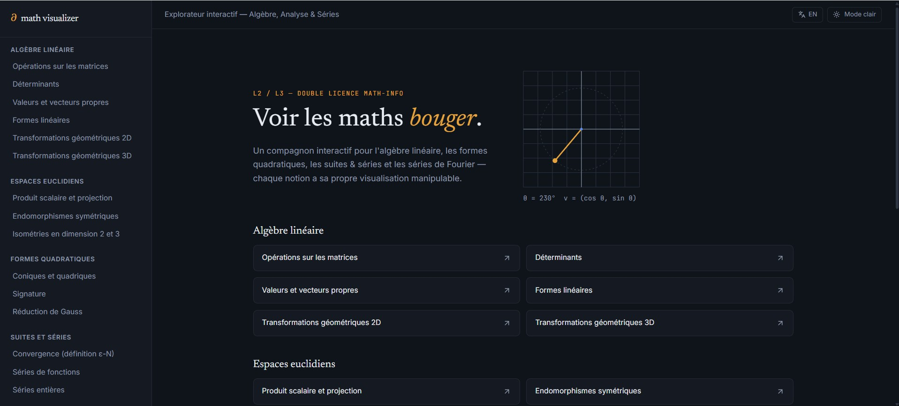
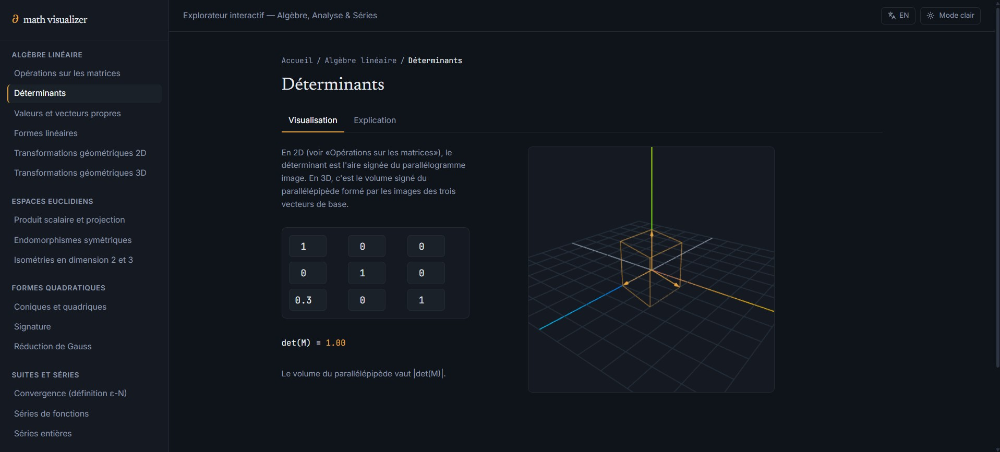
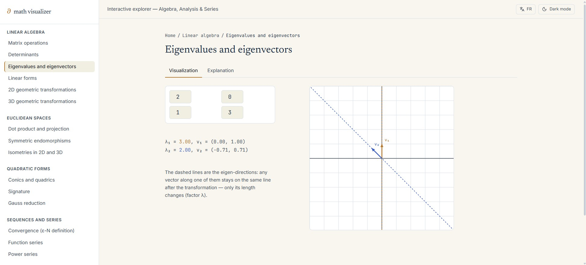

# Math Visualizer (July-August 2026)

An interactive visualization platform for undergraduate mathematics — linear algebra, Euclidean spaces, quadratic forms, sequences & series, and multivariable analysis — where every topic gets its own hands-on visualizer instead of a static explanation: drag a vector, edit a matrix, type your own function, and watch the math respond live.

## Live Demo

[Link](https://math-visualizer-orcin.vercel.app/)

## Screenshots





## Features

- **18 interactive visualizers** across 5 categories — matrix operations, determinants, eigenvalues, linear forms, 2D/3D transformations, dot product & projection, symmetric endomorphisms, isometries, conics & quadrics, signature, Gauss reduction, ε-N convergence, function series, power series, parametric integrals, multiple integrals, and critical points.
- **Custom input** — type your own sequence, series, or function instead of only picking from presets (parsed safely with mathjs, not `eval`), with adjustable domains where relevant.
- **Bilingual** — a French/English toggle covers all site chrome and per-topic content.
- **Light/dark theme**, entirely driven by CSS custom properties, so new components inherit it automatically without extra work.
- **2D visuals** in hand-rolled SVG (a coordinate plane with pan/zoom, function plots); **3D visuals** in three.js (rotatable, zoomable scenes — transformations, determinants as volume, surfaces, gradient fields).

## Built With

- [React](https://react.dev/) — UI library, function components + hooks
- [Vite](https://vitejs.dev/) — build tool / dev server
- [React Router](https://reactrouter.com/) — client-side routing between topic pages
- [Tailwind CSS v4](https://tailwindcss.com/) — utility styling with token-based theming (`@theme`, no separate config file)
- [three.js](https://threejs.org/) — 3D scenes (transformations, surfaces, isosurfaces)
- [KaTeX](https://katex.org/) — math formula rendering
- [mathjs](https://mathjs.org/) — safe expression parsing for custom user input
- [lucide-react](https://lucide.dev/) — icons

## Running Locally

```bash
git clone https://github.com/bianca574/math-visualizer
cd math-visualizer
npm install
npm run dev
```

Then open the local URL shown in your terminal (usually `http://localhost:5173`).

## Project Structure

src/
├── components/ # shared UI: CoordinatePlane, FunctionPlot, Scene3D, Sidebar, Layout, Slider...
├── context/ # LanguageContext (FR/EN)
├── data/ # topics.js — single source of truth for the sidebar and home page
├── lib/ # pure math logic: matrices, eigenvalues, quadratic forms, isometries, custom function parsing, UI strings
├── pages/ # Home, TopicPage (routing shell)
├── topics/ # one component per visualizer, registered in registry.js

## What I Learned

This project is built on what I picked up from my first one — components, hooks, routing — and pushed further into things I hadn't done before: designing a token-based theming system from scratch (CSS custom properties driving both Tailwind and raw SVG/three.js colors at once), building reusable rendering engines (a coordinate-plane component and a three.js scene wrapper that every visualizer reuses instead of duplicating setup code), and safely evaluating arbitrary user-typed math expressions with a parser instead of `eval`. Debugging cross-file consistency issues — a placeholder left in by mistake, a key mismatch between files — was also a real lesson in how far a single typo can cascade in a multi-file React app.

## License

All rights reserved.
